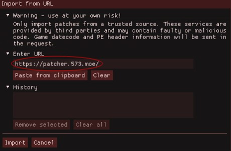
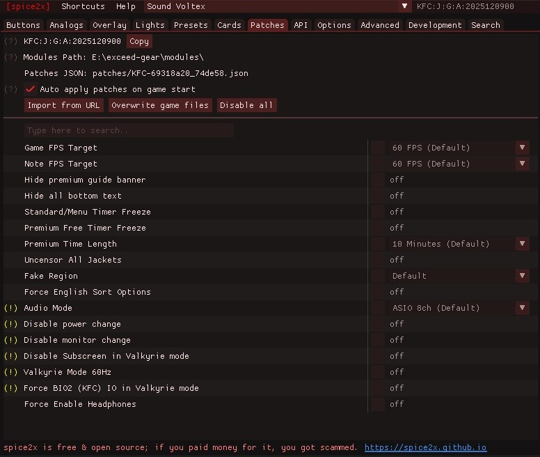

# A Spice2x game patcher

This is a collection of patches/hex edits for modern BEMANI titles. Patches here are meant to be used with [spice2x](https://spice2x.github.io/) via the `Patches` menu.

### URL: `https://patcher.573.moe`

**Do not share arcade data publicly. Support arcades when possible.**

## Usage

If you're already familiar with spice2x's `Patches` menu, simply import patches from the following URL:  `https://patcher.573.moe/`

For users unfamiliar with patching in spice2x, click on one of the methods below and follow the steps:

Method #1: Import from URL (easiest)

> [!TIP]
> If you're having trouble following these steps, update spice2x to the latest stable release from https://spice2x.github.io/.

The easiest way to patch game files is by importing patches from a URL, this process just takes a few clicks.
You can do this by opening `spicecfg.exe` directly, or by typing `spice64 --cfg` into the command line.

Click on the `Patches` tab at the top. This will open up a new menu.

Click the `Import from URL` button.

Type or paste `https://patcher.573.moe` into the `Enter URL` box, then click the `Import` button at the bottom.

As long as your game is [supported](/SUPPORTED.md), a list of patches will show up below. You can then hover over a patch to learn more about what it does.

Method #2: Reading from JSON

This method can be used if you are unable to or otherwise don't want to import patches from URL. Please note that importing from URL will still create a `patches` directory containing the JSON file(s) with your patches. 

- Open [SUPPORTED.md](/SUPPORTED.md) and make sure the game and version you're patching is supported
- Click on the *Identifier* link for the version you're patching. Then click the download button (*Download raw file*) in the top right
- If there is not already a folder in the same directory as `spicecfg.exe` named `patches`, make one
- Move/copy the JSON file you downloaded into `patches`
- Open `spicecfg.exe` and navigate to the `Patches` tab on top
- If you did everything correctly, your patches will show up here. You can hover over a patch to learn more about what it does

## Troubleshooting / FAQ

### Which patches should I use?

**Only use the patches you need and/or understand.** Which patches to apply are often setup dependent. For example, if your monitor is limited to 60Hz, you'll likely have to patch your game to run at a lower FPS.

### My game crashes when starting

**Check your log first, then change settings if needed.** The first thing you should do after a crash is check `log.txt` and look for a spice2x auto-troubleshooter message. *Often times, this tells you what to do.*

A common reason for crashing when the game starts is a mismatch between your `Autio Mode` or `Shared mode WASAPI` and your device's sample rate. If you're using WASAPI exclusive audio, or `Shared mode WASAPI` is unchecked, make sure your device is set to 44100Hz. For WASAPI shared audio, make sure your device is set to 48000Hz.

More about audio modes

ASIO audio will not work without specialized hardware and your ASIO driver set in spice2x. Without the correct setup, your audio mode will fall back to WASAPI exclusive.

For a detailed overview of audio modes, read [Audio modes demystified](https://github.com/spice2x/spice2x.github.io/wiki/Audio-modes-demystified) on the spice2x wiki.

### "Import failed" when importing patches from URL

**Make sure your game version is supported.** An import failed error with code 404 most often means your game/version isn't supported here. You are welcome to open a new issue asking for support or contribute patches yourself.
 
### Should I click "Overwrite game files" after patching?

**Only if you're on an arcade cab image or if you know what you're doing.** Pressing this button will replace your game's DLL with a patched one and write a backup to `{module}.bak`. *You should still back up your own game files anyway.* This option is often used on arcade cabinets where your saved patches are discarded after rebooting.

Otherwise, your patches are automatically applied when starting the game through spice, and there's nothing more you have to do after selecting patches and booting up. For this to work, make sure `Auto apply patches on game start` is checked.

## Other Resources

### **Spice2x Wiki:** [Patching DLLs (hex edits)](https://github.com/spice2x/spice2x.github.io/wiki/Patching-DLLs-(hex-edits))

Has more information about patching, going further in depth and explaining more patch methods. Check the right-hand sidebar for known issues and more information about spice2x.

### **Spice2x Wiki:** [patches.json specification](https://github.com/spice2x/spice2x.github.io/wiki/patches.json-specification)

For developers. If you'd like to contribute patches, they must follow this specification.

### **RE: TWO-TORIAL:** [Game Patching (spice2x)](https://re-two-torial.xyz/extras/patchsp2x/)

Another guide on how to use the spice2x built-in patcher. Most of the information on this site is available here. Two additional patching guides, [Game Patching (web)](https://re-two-torial.xyz/extras/patchweb/) and [Game Patching (hex editing)](https://re-two-torial.xyz/extras/hexguide/), can be found here.

### **DJTRACKERS:** [BemaniPatcher for spice2x](https://djtrackers.github.io/BemaniPatcher/)

Another patcher with support for BEMANI titles. If we don't have support for something, you might find it here.

### **mon.im:** [BemaniPatcher](https://bemanipatcher.mon.im/)

A web patcher that supports older games and versions. If we don't have a patch for something more than a year old, look for it here.

## Patch Contributions

[Logthm](https://github.com/Logthm) - "Enable Average Score Display" for `KFC-2026042103` and newer (#3)

[takanashiryo](https://github.com/takanashiryo) - "Hide Timer" for `KFC-2025122600` and newer (#1), 
"Audio Mode" for `KFC-2025120900` and newer (#2)

**Patches hosted on here are based on patches from mon's BemaniPatcher and two-torial's (defunct) sp2xpatcher. This project would not be possible without those who contributed to BemaniPatcher and two-torial.**